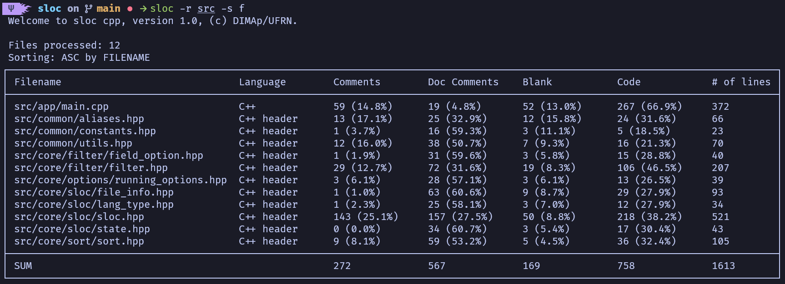

<h1 align="center">💻 sloc — source lines of code</h1>

<p align="center">
    <b>sloc</b> is a command-line application metric used to measure the number of empty line of codes and comments in a program's source code.
</p>

<p align="center">
    
</p>

## 👨‍💻 Authors

This project was developed by José Carlos da Paz Silva [carlos.paz.707@ufrn.edu.br](mailto:carlos.paz.707@ufrn.edu.br) and [leandro.andrade.401@ufrn.edu.br](mailto:leandro.andrade.401@ufrn.edu.br) as part of the *Programação I* course at UFRN.

## 🚀 Compiling and Runnig

### 🛠️ Using cmake

*Note:* This method requires CMake to be installed on your system. CMake is a cross-platform build system generator used to configure and compile the project. If it's not already installed, you can install it using your system’s package manager (e.g., sudo apt install cmake on Debian/Ubuntu or brew install cmake on macOS).

1. Clone this repository:

```bash
git clone https://github.com/selan-active-classes/t03-projeto-sloc-qwerty
```

2. Navigate to the project directory:

```bash
cd t03-projeto-sloc-qwerty
```

3. Compile and build the program using `cmake`:

```bash
cmake -S . -B build
cmake --build build
```

4. Run:

```bash
./build/sloc <options>
```

### 🛠️ Without cmake

Alternatively, you can compile this project without cmake, manually using C++ compilers, such as c++ or clang, to do so

1. Clone this repository:

```bash
git clone https://github.com/selan-active-classes/t03-projeto-sloc-qwerty
```

2. Navigate to the project directory:

```bash
cd t03-projeto-sloc-qwerty
```

3. Create a `build` directory:

```bash
mkdir build
```

4. Compile with `g++`:

```bash
g++ -I src/common/ -I src/core/ src/app/main.cpp -o ./build/sloc -Wall -Wextra -pedantic -std=c++17 -O2
```

or `clang++`

```bash
clang++ -I src/common/ -I src/core/ src/app/main.cpp -o ./build/sloc -Wall -Wextra -pedantic -std=c++17 -O2
```

5. Run:

```bash
./build/sloc <options>
```

### ⚙️ Using bash script

You can also build and compile sloc using just one command line. Run the script ()[configure.sh] as sudo and wait for it to finish executing.

1. Compile and build:

```bash
./configure.sh
```

2. Run:

The `configure.sh` already globally installs sloc on your machine. Just make the direct call:

```bash
sloc <options>
```

---

> [!tip]
> Run **./build/sloc [-h | --help ]** to view all available options and usage instructions.

---

## ⚠️ Problems found or limitations

### Programming languages support

The current implementation of **sloc** has limited support for programming languages, being compatible exclusively with C and C++ files. This means that analysis features such as counting lines of code, comments and blank lines are only adjusted to the syntax and structure of these two languages. Future versions may include support for other popular languages, such as C#, Rust, Java and others.

---

&copy; DIMAp | Departamento de Informática e Matemática Aplicada (2016 - 2025)
